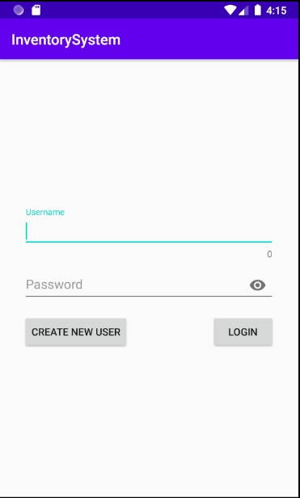
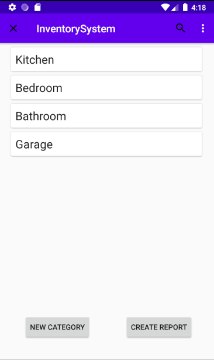
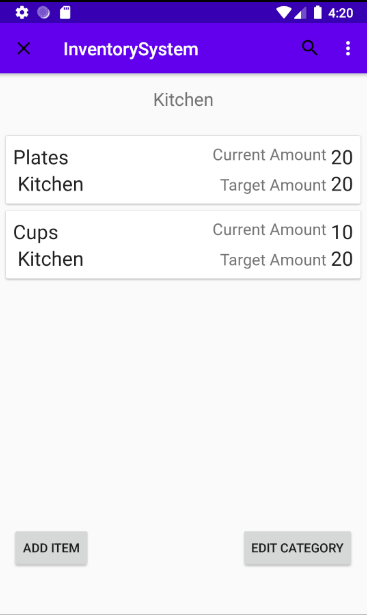
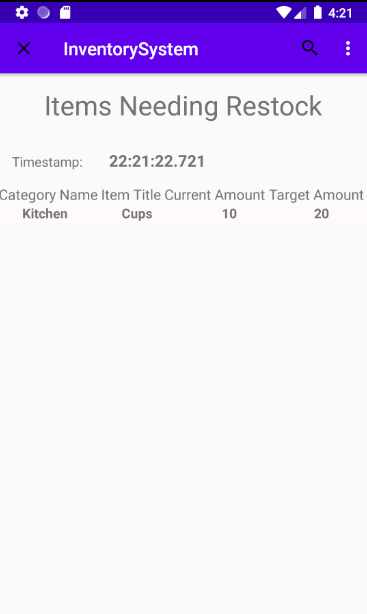

# Inventory System Android App

This android app is meant to help you keep track of any sort of inventory you may find a use for.

## Features

- Uses a login system to track inventory based on the user that is ligged in to the system.

- Ability to categorize inventory based on Location (Rooms, Stores, etc.)

- Keep track of amounts of items in each location.

- Ability to edit the categories and items.
- Generate report of items that need to be replenished to meet quantity goals.

